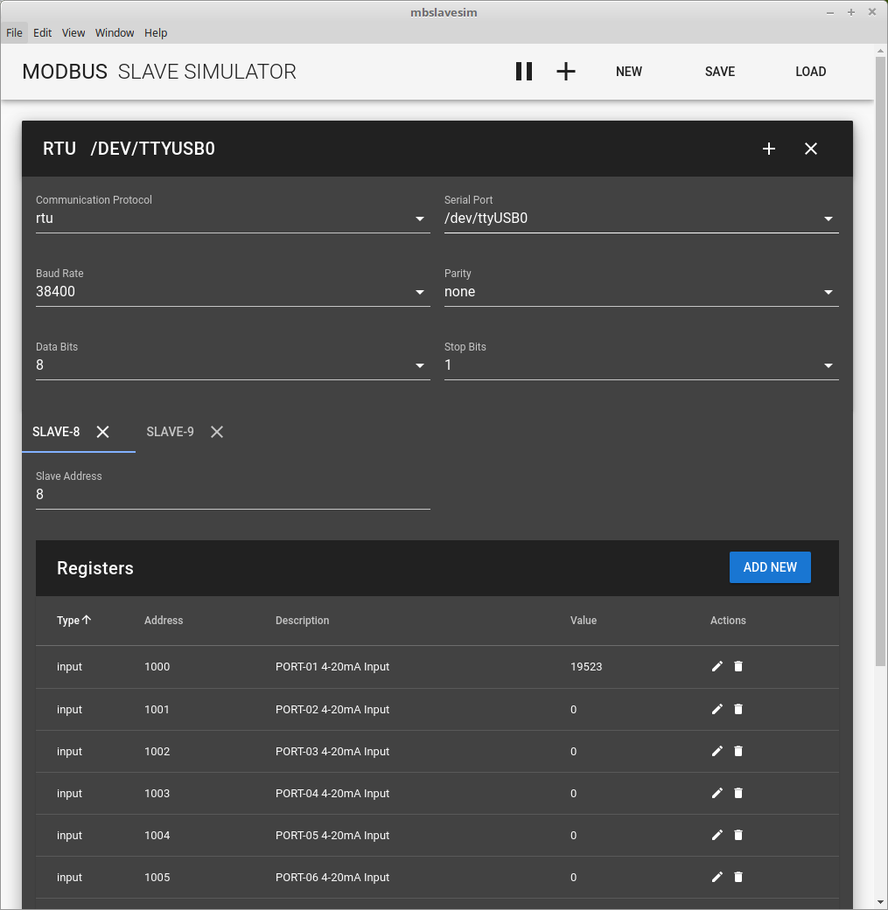

# mbslavesim

A simple modbus slave simulator using electron/javascript.

Unlike typical modbus slave simulators, this one supports multiple slaves in a single app.

I developed it for my personal use, and you are more than welcome to use this and improve it yourself.

## Setup & Run
1. yarn install
2. node_modules/.bin/electron-rebuild
3. npm run electron:serve

I don't know why but it looks like dependencies are broken with npm.
Go with yarn (sudo npm install -g yarn). It's much faster too.

Also it looks like we have to run electron-rebuild after fresh install.

## ToDo
1. Serial Port List Probing
2. Some final touches on UI
3. Register list improvement for easier manipulation & visualization
4. Better store structure for configuration and runtime.
